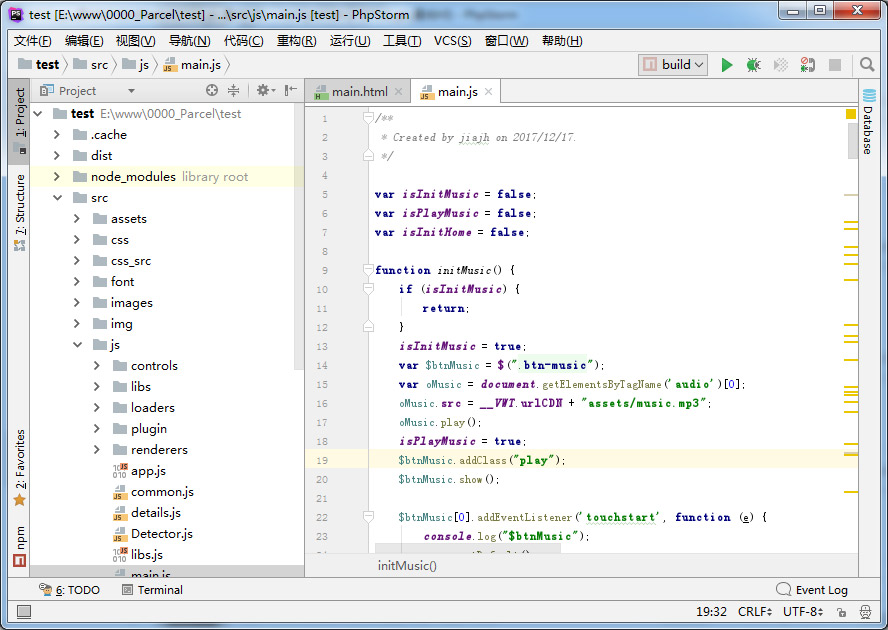

## PhpStorm Chinese Language Pack（中文语言包）

把压缩包里的"resources_zh_CN.jar"拷贝到PhpStorm安装目录下的lib目录，重启即可！

主要是扫描WebStorm的翻译，做的这个中文语言包，汉化程度有限……

###增加了繁体中文支持（工具扫描翻译，有误还请见谅）

----------

**markdown 插件乱码**的问题参见[WebStorm汉化包](https://github.com/ewen0930/WebStorm-Chinese)里说明
